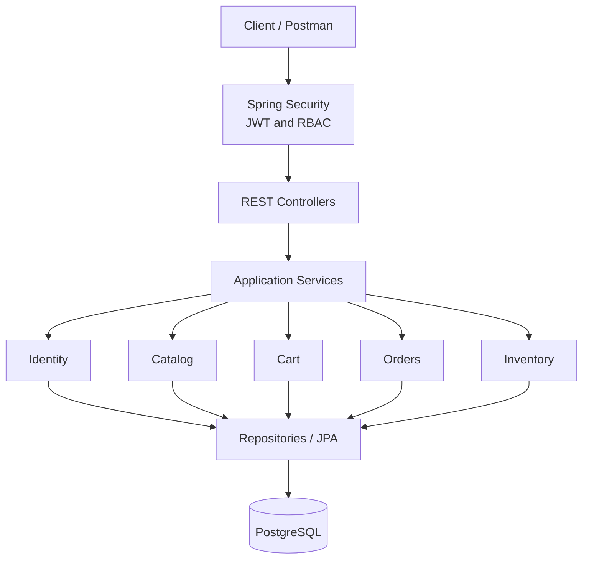

# OrdexaFlow API

OrdexaFlow is a production-oriented commerce and order-management backend built as a modular Spring Boot monolith. It is designed to demonstrate secure API design, transactional order processing, safe inventory updates, relational database design, automated testing, and production delivery practices.

> Status: Phase 1 — foundation.

## Problem

The system supports customers who browse products, maintain a cart, and place orders, plus administrators who manage the catalog, inventory, and order lifecycle. Checkout must preserve data consistency and prevent overselling when customers purchase concurrently.

## Version 1 scope

- Account registration and JWT authentication
- User and admin role-based authorization
- Product, category, and inventory management
- Product browsing, filtering, sorting, and pagination
- One active cart per customer
- Transactional order placement from a cart
- Customer order history and admin order management
- Validation and consistent API errors
- PostgreSQL schema managed by Flyway
- OpenAPI documentation, tests, Docker, and CI

OAuth2, external payment processing, Redis, notifications, and Azure deployment are deliberately deferred.

## Planned stack

- Java 21 and Spring Boot
- Spring Web, Security, Data JPA, Validation, and Actuator
- PostgreSQL and Flyway
- JWT access/refresh tokens
- OpenAPI/Swagger
- JUnit 5, Mockito, MockMvc, and Testcontainers
- Docker Compose and GitHub Actions

## Architecture



The codebase begins as one deployable application with boundaries around `auth`, `users`, `catalog`, `cart`, `orders`, and `inventory`. See [architecture](docs/architecture.md) for the dependency rules and security flow.

## Run locally

Prerequisites: Java 21, Maven 3.6.3+, and Docker.

```bash
docker compose up -d postgres
mvn spring-boot:run
```

Then open:

- Health: `http://localhost:8080/api/v1/health`
- Actuator: `http://localhost:8080/actuator/health`
- Swagger UI: `http://localhost:8080/swagger-ui.html`

Local database defaults are intended only for development and can be overridden with `DB_URL`, `DB_USERNAME`, and `DB_PASSWORD`.

## Design documents

- [Business requirements](docs/requirements.md)
- [Architecture and package design](docs/architecture.md)
- [Database design and ER diagram](docs/database-design.md)
- [REST API plan](docs/api-design.md)

## Delivery roadmap

1. Design and decisions
2. Spring Boot, PostgreSQL, Flyway, health, and OpenAPI foundation
3. Authentication and authorization
4. Catalog and inventory
5. Cart and checkout
6. Orders, transactions, and concurrency protection
7. Performance, validation, auditing, and observability
8. Tests, containers, CI, and documentation polish

## Definition of done

Version 1 is complete when its documented acceptance criteria pass, the application starts with Docker Compose, Flyway creates a clean database, automated tests run in CI, OpenAPI describes every public endpoint, and no secrets are committed.
