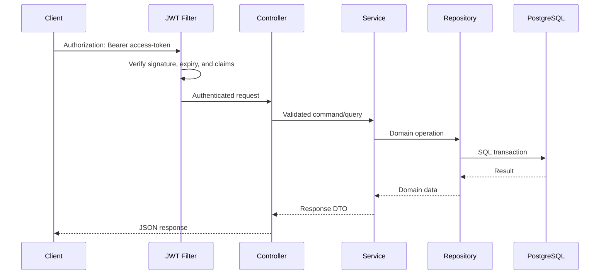
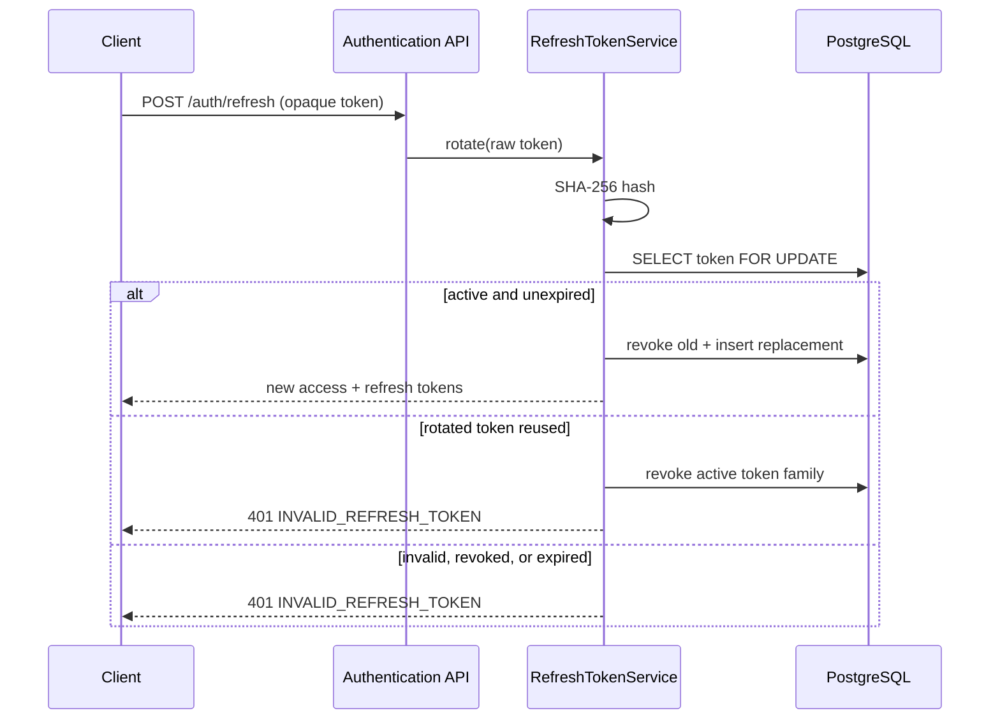
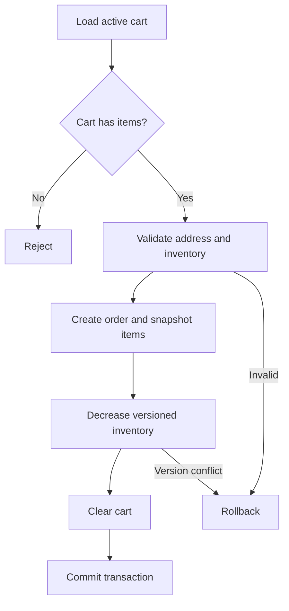

# Architecture

## Style

OrdexaFlow is a modular monolith: one Spring Boot process and one PostgreSQL database, with feature boundaries that keep business logic cohesive. This provides straightforward deployment and transactions without prematurely introducing distributed-system failure modes.

## Proposed package layout

```text
com.deep.ordexaflow
├── OrdexaFlowApplication.java
├── common
│   ├── config
│   ├── exception
│   └── web
├── auth
│   ├── api
│   ├── application
│   ├── domain
│   ├── infrastructure
│   └── security
├── users
│   ├── api
│   ├── application
│   ├── domain
│   └── infrastructure
├── catalog
├── inventory
├── cart
└── orders
```

Each feature follows the same internal shape only where useful:

- `api`: controllers and request/response DTOs
- `application`: use-case services and transaction boundaries
- `domain`: entities, value objects, policies, and domain exceptions
- `infrastructure`: Spring Data repositories and external adapters

Avoid a global `entity`, `controller`, or `repository` package. Feature code should normally depend on another feature through an application-facing interface rather than its repository.

## Request flow



Controllers remain thin. Application services enforce business rules and own transactions. Repositories handle persistence. JPA entities never cross the API boundary.

## Security architecture

- Stateless access JWTs are short-lived and signed using a secret/key supplied outside source control.
- Refresh tokens are 256-bit opaque random values; only SHA-256 hashes are stored in the database.
- Refresh tokens are single-use and rotate inside a database transaction guarded by a pessimistic row lock.
- A token family identifies one login session. Reuse of an already-rotated token revokes the family's
  remaining active tokens; logout revokes the supplied token.
- The JWT filter authenticates access tokens before controller invocation.
- URL rules provide coarse access control; `@PreAuthorize` protects sensitive application methods.
- `/api/v1/auth/**`, public `GET /api/v1/products/**`, OpenAPI in non-production profiles, and liveness/readiness are permitted as explicitly configured.
- All other endpoints require authentication; `/api/v1/admin/**` requires the admin role.
- Ownership checks occur in service queries (for example, lookup by both order ID and authenticated user ID).

### Refresh-token flow



## Checkout transaction



Order creation, inventory reduction, and cart clearing share one `@Transactional` boundary. Inventory carries an optimistic-lock version. A conflict returns HTTP 409 and the client may re-read stock before retrying.

## Data and performance rules

- Relationships are lazy by default.
- API queries use explicit fetch joins, entity graphs, or projections when related data is required.
- Pagination is performed at the database, never after loading an unbounded collection.
- Indexes support known access patterns and are documented in the database design.
- Historical order item data is snapshotted, avoiding dependence on mutable catalog values.

## Configuration and environments

- Spring profiles: `local`, `test`, and `prod`.
- Secrets and environment-specific connection data arrive through environment variables or a secret store.
- Local dependencies run through Docker Compose.
- Production disables verbose SQL, public Swagger unless intentionally enabled, and nonessential actuator exposure.

## Architecture decisions

| Decision | Rationale |
|---|---|
| Modular monolith | Simple deployment and reliable local transactions while retaining clear boundaries |
| PostgreSQL in tests | Avoid behavioral differences introduced by H2 |
| Flyway owns schema | Repeatable, reviewed database evolution |
| DTOs at API boundary | Stable contracts and no accidental lazy loading/data exposure |
| Optimistic inventory locking | Efficient for normal contention and prevents lost updates |
| Price snapshots in order items | Historical orders remain correct after catalog changes |
| Soft product discontinuation | Preserves referential and historical integrity |
| Optimistic inventory version | Detects concurrent stock updates without serializing normal catalog reads |
