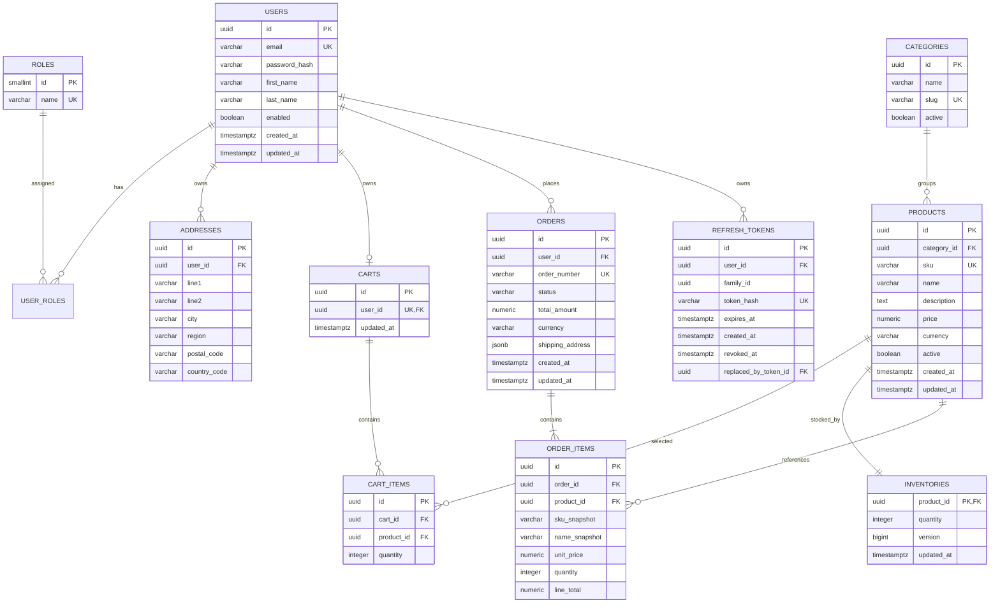

# Database Design

## ER diagram



## Constraints and invariants

- Emails are normalized to lowercase before persistence and enforced unique.
- `products.price`, `orders.total_amount`, and order-item amounts are non-negative.
- Inventory and item quantities use check constraints; inventory permits zero, item quantity does not.
- `(cart_id, product_id)` is unique so a product occurs once per cart.
- One cart per user is enforced by `carts.user_id` uniqueness.
- Currency is a three-letter ISO-style code and all Version 1 order items share the order currency.
- Order totals are calculated by the server from item snapshots, never accepted from the client.
- Shipping address is copied into the order as a JSON snapshot so later address edits do not rewrite history.
- Product rows referenced by orders are not physically deleted.
- Raw refresh tokens are never persisted; `token_hash` contains a SHA-256 digest.
- Rotated refresh tokens are revoked and point to their replacement. All tokens created from one login
  session share a `family_id` so replay detection can revoke the entire session.

## Planned indexes

| Index | Access pattern |
|---|---|
| Unique `users(email)` | Login and duplicate-registration check |
| Unique `products(sku)` | Administrative SKU lookup |
| `products(category_id, active)` | Public category browsing |
| `products(active, created_at desc)` | Default catalog listing |
| `orders(user_id, created_at desc)` | Customer order history |
| `orders(status, created_at)` | Admin fulfillment queue |
| `refresh_tokens(user_id)` | Revoke sessions for a user |
| `refresh_tokens(family_id)` | Revoke a compromised rotation family |
| `refresh_tokens(expires_at)` | Remove expired token records in bounded batches |
| Unique `cart_items(cart_id, product_id)` | Cart lookup and duplicate prevention |

Text search begins with a portable case-insensitive name query. A PostgreSQL trigram or full-text index should be introduced only after its query and performance need are measured.

## Migration plan

Initial migration files should be grouped by coherent schema capability rather than one file per table:

```text
V1__create_identity_schema.sql
V2__create_refresh_tokens.sql
V3__create_catalog_and_inventory.sql
V4__create_cart_schema.sql
V5__create_order_schema.sql
V6__add_query_indexes.sql
```

Migrations are append-only after they have been shared. Tests must start from an empty PostgreSQL database and apply the same migration chain used in production.
